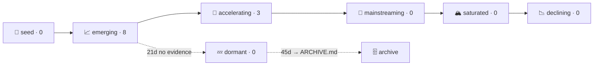

# AI Radar — dashboard

Generated from [TRENDS.md](TRENDS.md) on 2026-06-12 — derived view, do not edit by hand.

## Stage pipeline

## 🚀 Accelerating (3)

| id | trend | confidence | last evidence |
|---|---|---|---|
| lowbit-quant-011 | Ultra-low-bit quantization: vector and trellis coding for weights and KV cache | medium | 2026-06-12 |
| mcp-standard-001 | MCP as the standard integration layer for agents (stateless core, Apps, Tasks) | medium | 2026-06-11 |
| pd-disagg-002 | Prefill/decode disaggregation as the standard LLM serving architecture | medium | 2026-06-11 |

## 📈 Emerging (8)

| id | trend | confidence | last evidence |
|---|---|---|---|
| agent-sandbox-007 | Remote sandboxes as the execution layer for agents | medium | 2026-06-11 |
| small-cpu-models-008 | Small and 1-bit models: CPU-first and on-device inference | medium | 2026-06-11 |
| multi-agent-eng-009 | Multi-agent engineering becomes product surface (teams, workflows, A2A) | medium | 2026-06-11 |
| open-weight-003 | Open-weight wave: frontier-scale MoE released at high cadence by Chinese labs | medium | 2026-06-08 |
| latent-comm-010 | Latent-space communication between models (cache-to-cache, latent collaboration) | medium | 2026-06-05 |
| rl-env-005 | Verifiable RL environments as an infrastructure category for agent training | medium | 2026-05-21 |
| agent-security-004 | Agent security: formal limits of prompt-injection defenses and the architectural turn | medium | 2026-05-17 |
| latent-reasoning-006 | Latent-space reasoning and recursive computation (looped models, latent multi-agent) | medium | 2026-04-28 |

## Watchlist

9 unverified signals in [observation_queue](TRENDS.md#observation_queue). Newest:

- 2026-06-12 — "MiniMax M3" still aggregator-only; HF org page tops out at MiniMax-M2.7
- 2026-06-12 — MiniMaxAI VTP visual tokenizers (Small/Base/Large) — single org, below the trend bar
- 2026-06-12 — ik_llama.cpp TurboQuant KV-cache port: CPU done, CUDA pending, not merged

## Latest reports

- Daily: [2026-06-12](reports/2026-06-12.md)
- Weekly: none yet
